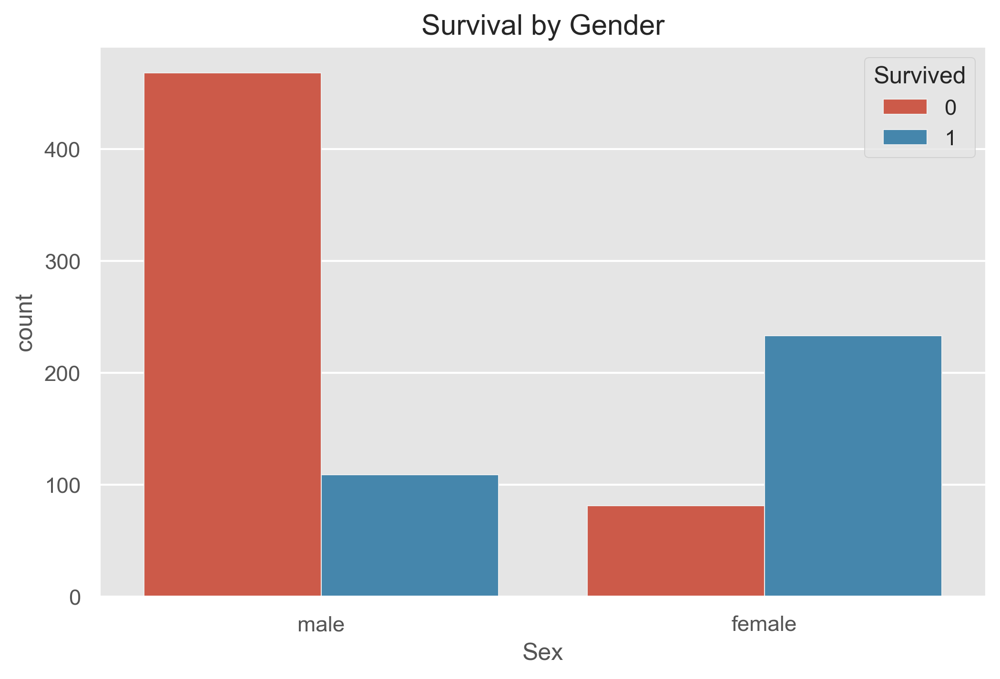
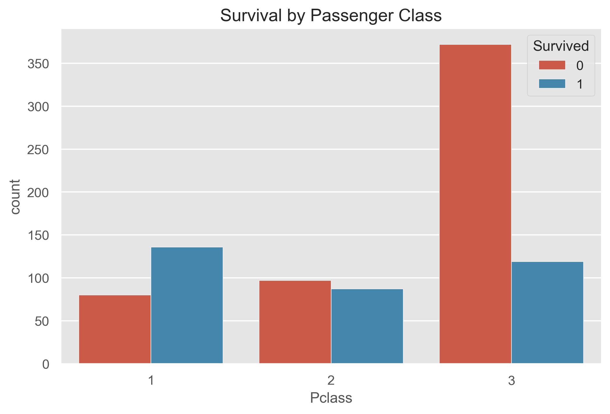
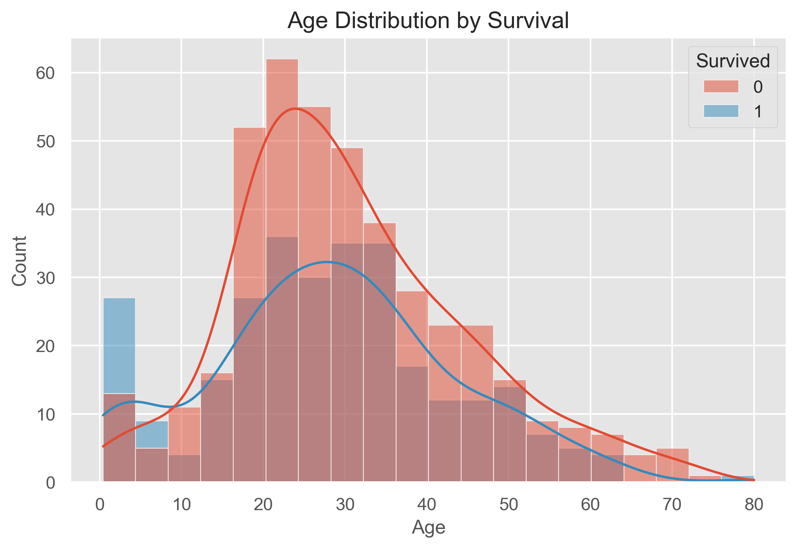
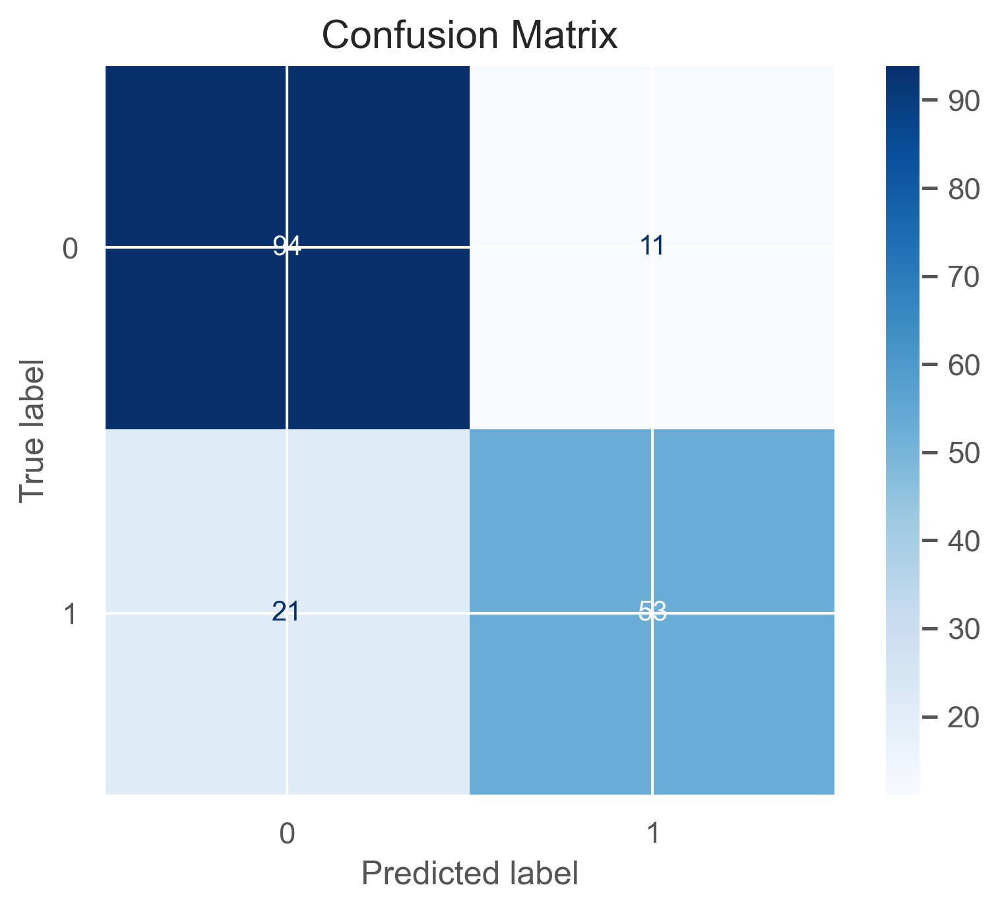

# Titanic Survival Prediction – Machine Learning Project

A complete end-to-end Machine Learning project based on the legendary **Kaggle Titanic Dataset**.  
This project explores passenger survival patterns with visualizations, builds an ML model, and generates predictions for Kaggle submission.

---

## Project Overview

The goal is to predict whether a passenger survived the Titanic disaster using:

- Exploratory Data Analysis (EDA)
- Data Cleaning & Preprocessing
- Feature Engineering
- Machine Learning (Random Forest Classifier)
- Model Evaluation
- Final Kaggle Submission File

This project is structured following industry-grade ML pipeline standards.

---

## Folder Structure

```
Titanic-Survival-Prediction/
│
├── data/                     # Raw dataset files
│     ├── gender_submission.csv
│     ├── test.csv
│     ├── train.csv
│
├── images/                   # Saved visualization outputs
│     ├── age_distribution.png
│     ├── confusion_matrix.png
│     ├── fare_boxplot.png
│     ├── feature_importance.png
│     ├── gender_survival.png
│     ├── survival_by_class.png
│     ├── survival_by_gender.png
│
├── Titanic_Survival_Prediction.ipynb   # Jupyter Notebook (Main project)
├── titanic_excel_dashboard.xlsx        # Excel dashboard (Optional)
├── submission.csv                      # Final Kaggle submission file
└── README.md                           # Project documentation
```

---

## Data Preprocessing

Key transformation steps used:

- Filling missing values:
  - `Age` → median
  - `Fare` → median
  - `Embarked` → mode
- Label Encoding:
  - `Sex`
  - `Embarked`
- Dropping irrelevant columns:
  - `Name`, `Ticket`, `Cabin`
- Feature Engineering:
  - `FamilySize = SibSp + Parch + 1`

Preprocessing function is reusable and scalable.

---

## Exploratory Data Analysis (EDA)

Visual insights include:

### Survival by Gender  


### Survival by Class  


### Age Distribution  


### Fare Boxplot  


### Confusion Matrix  


### ✔ Feature Importance  


These visualizations uncover survival patterns and help build feature intuition.

---

## Machine Learning Model

Model used:

**RandomForestClassifier**

```
n_estimators = 300
max_depth    = 10
random_state = 42
```

After training the model:

```
Accuracy: ~85% (approx)
```

Confusion Matrix is included in `/images`.

---

## Kaggle Submission

Final predictions on `test.csv` were exported as:

```
submission.csv
```

Format:

```
PassengerId, Survived
892, 0
893, 1
...
```

---

## Technologies Used

- Python  
- Jupyter Notebook  
- Pandas  
- NumPy  
- Seaborn  
- Matplotlib  
- Scikit-Learn  
- Excel (optional dashboard)

---

## How to Run

1. Clone the repository:
   ```
   git clone https://github.com/<your-username>/Titanic-Survival-Prediction.git
   ```

2. Install dependencies:
   ```
   pip install -r requirements.txt
   ```

3. Open Jupyter Notebook:
   ```
   jupyter notebook
   ```

4. Run:
   ```
   Titanic_Survival_Prediction.ipynb
   ```

---

## Final Notes

This project demonstrates:

- Data cleaning  
- EDA visualization skills  
- Feature engineering  
- ML model building  
- Real-world problem solving  
- Kaggle-ready workflow  

Perfect for portfolio, job applications, and LinkedIn showcase.

---

## Contact

If you want to connect or collaborate — feel free to reach out!
